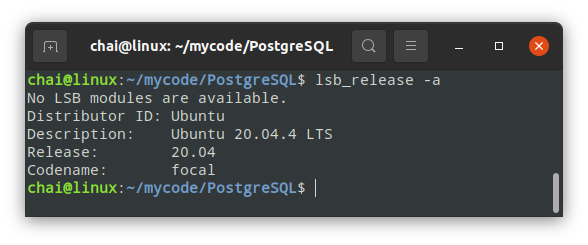
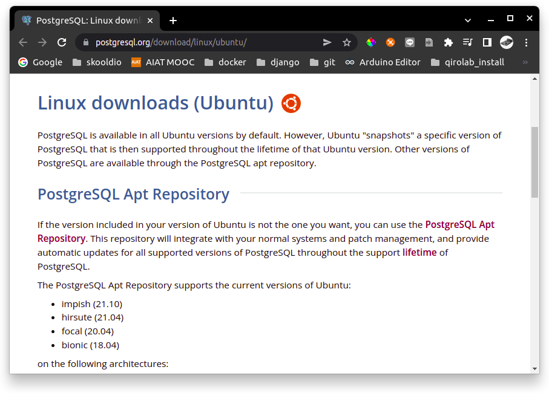
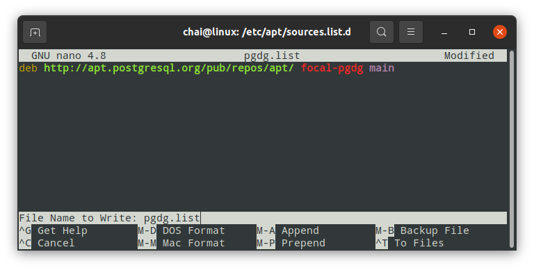
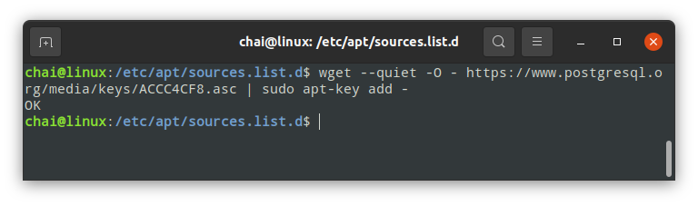

# `INSTALL PostgreSQL`

## `Check Ubuntu Version`

```
$ lsb_release -a
```



## ติดตั้งผ่าน [`PostgreSQL Apt Repository`](https://www.postgresql.org/download/linux/ubuntu/)



### `1. Create the file repository configuration:`
```
chai@linux:~$ cd /etc/apt/sources.list.d/
chai@linux:/etc/apt/sources.list.d$
chai@linux:/etc/apt/sources.list.d$ ls -l
chai@linux:/etc/apt/sources.list.d$ sudo nano pgdg.list
```


### `2. # Import the repository signing key:`
```
$ wget --quiet -O - https://www.postgresql.org/media/keys/ACCC4CF8.asc | sudo apt-key add -
```



### `3. Update the package lists:`
```
$ sudo apt update
```

### `4.Install the latest version of PostgreSQL.`
### `If you want a specific version, use 'postgresql-12' or similar instead of 'postgresql':`

```
$ sudo apt install postgresql-12
```

### `Run Postgres`
```
$ sudo su - postgres
$ exit
```

[`How To Install PostgreSQL on Ubuntu 20.04`](https://www.digitalocean.com/community/tutorials/how-to-install-postgresql-on-ubuntu-20-04-quickstart)

### `Run Postgres`
```
$ sudo -u postgres psql
```


